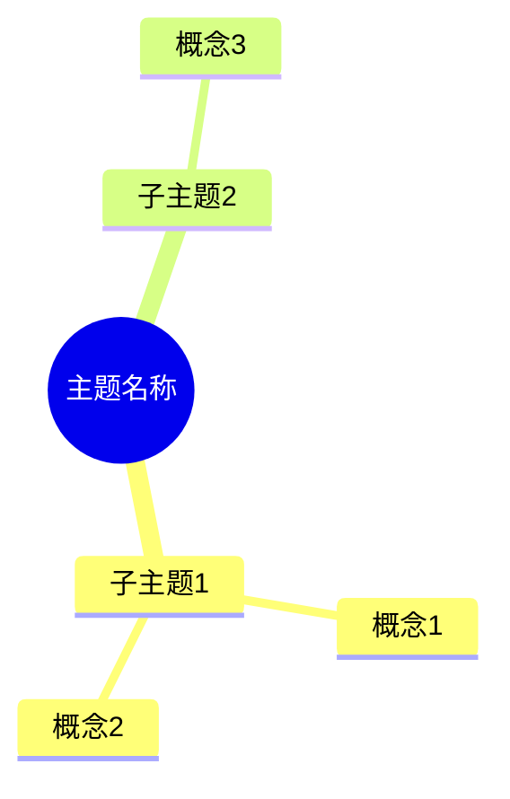

# 阵法核心模板

```markdown
---
type: 阵法核心
created: YYYY-MM-DD HH:mm:ss
modified:
mastery_level: 入门
linked_spirits: 0
cultivation_value: 50
tags: [阵法, 领域]
---

# 主题名称阵法

## 阵法概述
[这个主题的核心问题和探索方向]

## 核心灵石（关键概念）

### 基础灵石（入门必读）
- [[灵石1]]
- [[灵石2]]

### 中级灵石
- [[灵石3]]

### 高级灵石（阵法精髓）
- [[灵石4]]

## 阵法脉络（知识结构）


## 疑问与探索
[这个主题中尚未解决的问题]

## 相关阵法
-

## 修炼心得
[对这个主题的阶段性总结]

## 阵法变化时间线
- YYYY-MM-DD - 创建阵法

---
**修炼提示**: 阵法核心是连接知识的中枢，持续完善，定期回顾
```
